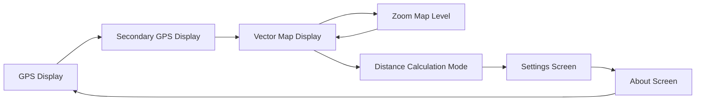

# ESP32 GPS Data Display

This project uses an ESP32 microcontroller to read data from a GPS module and display it on an OLED screen. 
It also calculates the distance between two set points using GPS coordinates and has a mode selection feature.

## Hardware Requirements

- ESP32 development board
  - ESP8266 can be used but the UART RX pins must be reassigned
- GPS module (compatible with UART) - GT U7M module used
- SSD1306 OLED display
- Buttons for setting points and switching modes
- LEDs for status indication
- A smile on your face

## Pin Configuration

- GPS Module: RX on pin 16
- OLED Display: SCL on pin 22, SDA on pin 21
- Set Button: pin 13
- Reset/Mode Button: pin 14
- Display toggle: pin 33
- Navigate button: pin 32
- Mode LED: pin 12
- Success LED: pin 26
- Error LED: pin 27
- Warning LED: pin 25
- PPS (Pulse Per Second) from GPS module input: pin 4

## Usage

1. Connect the hardware components according to the pin configuration.
2. Upload all files in the `src/` directory to the root directory of your ESP32 running MicroPython
   * Optionally use the Makefile to upload the files to the ESP32 using the `make flash` command.
3. Upload your GeoJSON file to the ESP32 flash memory.
   * This filename is currently hardcoded in `src/handlers/display_handler.py` as `simplified_out_0229.geojson`
4. Power on the device.
5. Drink a glass of water to stay hydrated.
6. The device will start in GPS display mode, showing real-time GPS data.
7. Press the reset/mode button to switch to distance calculation mode, settings, and the about screen.
8. In distance mode, press the set button to mark point A, then again to mark point B.
9. The device will display the calculated distance between the two points.

## Menu
The project has a menu system with the following screens:

## Note

The GPS module works best when you have a clear view of the sky. 

## License
This project is licensed under the GNU General Public License v3.0 (GPLv3), see `LICENSE` for more details.
This project uses the `ssd1306.py` driver from the MicroPython project, which is licensed under the MIT License. See `LICENSE-MIT`.
