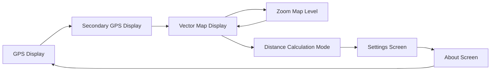

# ESP32-Powered Handheld GPS Unit 🌐

Follow this project's development on Hackaday.io: [PocketNav32](https://hackaday.io/project/199321-pocketnav-32) 📸  
---

This project uses an ESP32 microcontroller to process GPS data and display it on an OLED screen, creating a simple hackable platform.

### Current Features:
- Retrieves and displays latitude and longitude in real-time, including horizontal precision, altitude and number of satellites used.
- Computes the distance between two user-defined coordinates in meters.
- Displays a vector-based map with land and water features.
- A menu-driven interface enables users to adjust display and device settings.

## Hardware Requirements

- ESP32 development board
  - ESP8266 can be used but the UART RX pins must be reassigned
- GPS module (compatible with UART) 
    - GT U7M module used
- SSD1306 OLED display
    - Any I2C-compatible display can be used
- Buttons for setting points and switching modes
- LEDs for status indication
- Tools: `mpfshell`, or `make` for flashing code.
- A smile on your face

## Pin Configuration
| Component          | Pin Number |
|--------------------|------------|
| **GPS Module**     | RX: 16     |
| **OLED Display**   | SCL: 22, SDA: 21 |
| **Set Button**     | 13         |
| **Mode Button**    | 14         |
| **Display Toggle** | 33         |
| **Navigate Button**| 32         |
| **Mode LED**       | 12         |
| **Success LED**    | 26         |
| **Error LED**      | 27         |
| **Warning LED**    | 25         |
| **PPS (Pulse Per Second) from GPS**     | 4          |

## Installation and Usage

1. **Hardware Setup**: Connect the components according to the pin configuration.
2. **Code Deployment**:
    * Upload all files in the `src/` directory to the root directory of your ESP32 running [MicroPython](https://docs.micropython.org/en/latest/esp32/tutorial/intro.html)
    * Optionally use the Makefile to upload the files to the ESP32 using the `make flash` command.

3. **Map Data**:
   - Upload a GeoJSON map file to the ESP32 flash storage root directory.
   - Ensure the filename matches `simplified_out_0229.geojson` (hardcoded in `src/handlers/display_handler.py`).

1. Power on the device.
2. Drink a glass of water to stay hydrated.
3. The device will start in GPS display mode, showing real-time GPS data.
4. **Operation**:
    * Press the reset/mode button to switch to the vector map display, distance calculation mode, settings, and the about screen.
    * In distance mode, press the set button to mark point A, then again to mark point B.
        * The device will display the calculated distance between the two points.
    * In vector mapping mode, press the nav button to zoom in/out.

## Menu
The project has a menu system with the following screens:

## Note

The GPS module works best when you have a clear view of the sky. So, take a break and enjoy the outdoors for optimal results!

## Roadmap
* Map rendering improvements: Optimize vector map display and add more features, including allowing larger uploaded maps.
* Battery optimization: Improve power management for extended battery life.
* E-ink display usage.
* Additional sensors: Add sensors like compass or barometer for enhanced functionality.
* Navigation features: Add support for waypoint saving and route history.
* Build a 3D-printed enclosure.
* PCB design and layout.

Feel free to submit a PR for any of the above, or anything else you see that can be improved!

### Where to Buy Components
**Note:** These links are simply for your convenience, feel free to use and support your favourite online electronics retailer.

| **Component**       | **Description**                | **Purchase Link**                  |
|---------------------|--------------------------------|------------------------------------|
| **ESP32 Development Board** | ESP32S module (ESP32-WROOM-32 variations) | [Aliexpress](https://www.aliexpress.com/item/1005007370074458.html) |
| **GPS Module (GT U7M)**      | UART-compatible GPS module | [Aliexpress](https://www.aliexpress.com/item/1005001713388717.html) |
| **SSD1306 OLED Display**     | 128x64 I2C OLED display    | [Aliexpress](https://www.aliexpress.com/item/1005004355547926.html) |
| **Breadboard**                | Prototyping the circuit | [Aliexpress](https://www.aliexpress.com/item/1005004317066197.html) |
| **Push Buttons**             | Buttons for input   | [Aliexpress](https://www.aliexpress.com/item/1005005315348507.html) |
| **Status LEDs**              | LEDs for status indication  | [Aliexpress](https://www.aliexpress.com/item/1005004837079861.html) |
| **Resistors and Dupont Connectors**      | For connections and components | [Aliexpress](https://www.aliexpress.com/item/1005006378959096.html) |
| **Eternal Happiness**         | Equanimity with the Earth | Priceless |

Approximate build cost: $25 CAD.

## Contributing

**How to Contribute:**
	1.	Fork the repository and create a feature branch.
	2.	Follow PEP 8 for Python coding style.
	3.	Submit a pull request with a description of your changes.

## FAQs
* **Can I use a different GPS module?** Yes, ensure it supports UART. 
    * If a PPS pin is not used, adjust the PPS handler method in `src/handlers/gps_handler.py`
* **Does this work on ESP32-S1/2/3?** Yes. Change pin mapping configuration as needed.
* **Can I add more buttons or LEDs?** Update the pin configuration and handlers in `src/handlers/button_handler.py` and `src/handlers/led_handler.py` to accommodate additional components.
* **What MicroPython versions are supported?** Tested with MicroPython versions 1.23, 1.24, and v1.25.0-preview.72.g2e796d6c3 (2024-11-30).

## Screenshots 
Please see the Hackaday.io page [PocketNav32](https://hackaday.io/project/199321-pocketnav-32) for pictures and video of operation.

## License
This project is licensed under the GNU General Public License v3.0 (GPLv3), see `LICENSE` for more details.
This project uses the `ssd1306.py` driver from the MicroPython project, which is licensed under the MIT License. See `LICENSE-MIT`.
